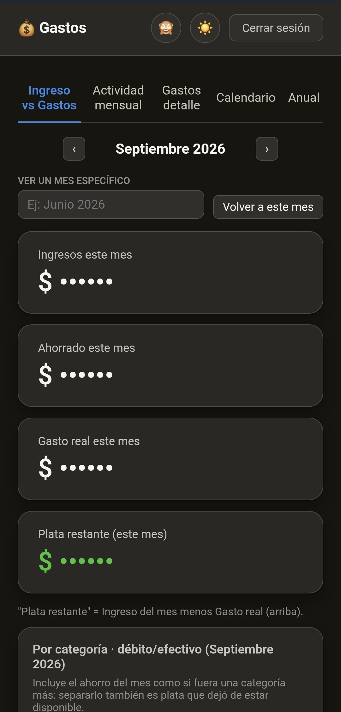
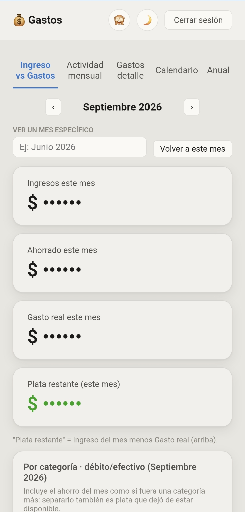

# Dashboard de gastos (PWA)

**100% gratis** — no usa IA ni tiene ningún costo, ni siquiera de hosting (ver
sección 3). Si lo combinás con el bot hermano (que sí usa IA para interpretar
gastos por voz), ese es el único componente del combo que puede tener un
costo de unos centavos de dólar por mes.

Página estática, **sin backend**: corre entera en el navegador y lee/escribe
directo una Google Sheet usando tu login de Google (no hace falta ningún
servidor propio).

**Lo que se despliega no necesita Python para nada** — es HTML/CSS/JS puro,
así que se puede alojar en Windows Server (IIS, o cualquier servidor de
archivos estáticos), GitHub Pages, o cualquier otro hosting (ver sección
3). Python solo se usa como herramienta de desarrollo, opcional, para
`setup.py` (armar una instalación nueva) y para probarlo en local antes de
subirlo (`python3 -m http.server`) — ninguno de los dos es parte de lo que
termina desplegado, y los dos corren en Windows también (ahí el comando
suele ser `python` en vez de `python3`, según cómo tengas instalado
Python).

> **Este repo es el "frontend"**: un dashboard para ver/editar gastos, pero
> no carga gastos nuevos por sí solo (aparte de "+ Agregar ingreso", que sí
> escribe). Para cargar gastos por voz automáticamente necesitás algo que
> escriba filas en la Sheet — el "backend" pensado para esto es el proyecto
> hermano **[controlador-gastos-bot-publico](https://github.com/josurzz/controlador-gastos-bot-publico)**
> (un bot de Telegram que transcribe audios e interpreta el gasto con IA).
> No es obligatorio: esta webapp funciona igual con cualquier Sheet que
> tenga la misma estructura de columnas, aunque los gastos se carguen a
> mano.

Se instala **una carpeta por persona** que la usa — este repo trae
`_example/` como plantilla; copiala para crear tu propia instalación (o una
por cada persona, si sois varias).

<p align="center">
  
  
</p>

*(los montos están ocultos a propósito con el botón 👁️ — es una función real del dashboard, no un editado de la captura)*

## 0. Requisitos

- Una Google Sheet con las columnas de gastos (la que ya carga el bot, o
  cualquiera con esa misma estructura).
- Un lugar donde alojar archivos estáticos (ver sección 3 — cualquiera
  sirve, no hace falta que sea Vercel).
- Un proyecto en [Google Cloud Console](https://console.cloud.google.com/)
  con la Google Sheets API habilitada y un **OAuth 2.0 Client ID** — se
  puede reusar el mismo Client ID para todas las instalaciones/personas (no
  hace falta uno por persona).

## 1. Crear el OAuth Client ID (una sola vez, se comparte entre instalaciones)

1. En Google Cloud Console: **APIs y servicios → Credenciales → Crear
   credenciales → ID de cliente de OAuth**. Tipo de aplicación: **Aplicación
   web**.
2. En **Authorized JavaScript origins**, agregá el dominio donde vas a
   alojar esto (ej. `https://tu-proyecto.vercel.app`, o el dominio que te dé
   el hosting que elijas — ver sección 3). Sin esto el login falla con un
   error de origen no autorizado. Podés agregar varios orígenes a la vez
   (por ejemplo uno de prueba local y otro real).
3. Si la pantalla de consentimiento OAuth está en modo "Testing" (lo normal
   en un proyecto personal, sin verificar con Google): en **Credenciales →
   Pantalla de consentimiento → Test users**, agregá el email de cada
   persona que vaya a usar el dashboard. Sin esto, ven "acceso bloqueado" al
   loguearse.
4. Compartí la Google Sheet con esa cuenta (o cuentas) dándole permiso de
   **Editor** (no alcanza con Lector, la webapp también edita gastos).

## 2. Agregar una instalación (una carpeta por persona)

Cada persona tiene su propia carpeta con su propio `index.html`,
`manifest.json` y `sw.js`, pero **todas comparten** `shared/app.js` y
`shared/style.css` — nunca dupliques esos dos archivos, solo lo de adentro
de tu carpeta cambia por instalación.

**`python3 setup.py`** (recomendado) — wizard interactivo: pregunta el
sheetId, el email (calcula el hash solo, nunca lo guarda en texto plano) y
el título, **crea la carpeta y el `index.html` solo** (no hace falta
copiar `_example/` ni editar nada a mano), valida que el nombre no exista
ya, y si ya tenés otra instalación te ofrece reusar el OAuth Client ID y
las categorías en vez de pedírtelas de nuevo. El paso 1 de más arriba
(crear el Client ID en Google Cloud) lo tenés que hacer igual a mano, eso
no se automatiza. Con esto podés saltear directo al paso 4 de abajo
(sumar la carpeta a `vercel.json`, si aplica).

Los pasos 1-4 de acá abajo son el **método manual** — quedan documentados
por si preferís hacerlo a pie o el script no cubre algo puntual:

1. Copiá la carpeta de ejemplo con un nombre nuevo:
   ```bash
   cp -r _example nombre-de-tu-instalacion
   ```
   El nombre de la carpeta queda en la URL — si no querés que se note de
   quién es (por ejemplo si vas a mantener tu fork público), usá un slug sin
   sentido en vez de tu nombre real (ej. `a3f9c1`, no `juan`).
2. Editá, dentro de `nombre-de-tu-instalacion/index.html`, el objeto
   `window.GASTOS_CONFIG`:

   ```js
   window.GASTOS_CONFIG = {
     sheetId: "...",           // el ID de la Sheet (parte de la URL entre /d/ y /edit)
     clientId: "...",          // el OAuth Client ID del paso 1 (el mismo para todas las instalaciones)
     titulo: "Gastos",         // lo que se ve en el título de la página
     allowedEmailHash: "...",  // ver más abajo cómo calcularlo
     categorias: [...],        // opcional: mismo orden que las categorías en tu bot, si usás uno
     nombreNoCredito: "débito/efectivo", // opcional, texto usado en algunos títulos/notas
     categoriasExcluidasPorDia: [],       // opcional: categorías a ignorar en el gráfico "Por día"
   };
   ```

   `allowedEmailHash` es el hash SHA-256 del email de esa persona (nunca el
   email en texto plano, para no dejarlo buscable en el código). Se calcula
   así:

   ```bash
   python3 -c "import hashlib; print(hashlib.sha256('el-email@gmail.com'.strip().lower().encode()).hexdigest())"
   ```

   Es un resguardo de UX del lado del cliente (rechaza en silencio, sin
   mensaje de error, cualquier cuenta que no sea la esperada) — el control de
   acceso real es a quién le compartiste la Sheet en el paso 1.4. No sirve
   para ocultar contenido de gente con acceso real a internet, ver la nota
   de "riesgos" más abajo.

3. También editá la línea del `<script>` en el `<head>` que lee
   `localStorage.getItem("gastos-tema-TU_SHEET_ID_ACA")` — tiene que usar el
   mismo `sheetId` que pusiste en `GASTOS_CONFIG` (está repetido a mano ahí
   porque en ese punto de la carga todavía no existe `CONFIG`, y sirve para
   evitar un parpadeo del tema equivocado).
4. Si vas a desplegar en Vercel (ver sección 3) y tu carpeta no se llama
   `_example`, sumala a `vercel.json` en la raíz del repo (mismo patrón que
   ya tiene) para que la barra final se redirija bien. Otros hostings no
   necesitan este archivo.

## 3. Desplegar

Esto es **HTML/CSS/JS plano, sin build, sin backend** — funciona en
cualquier hosting de archivos estáticos. Un ejemplo concreto con
[Vercel](https://vercel.com) (gratis):

1. **Add New Project** → importar este repo (puede ser privado, Vercel no
   necesita que sea público para desplegarlo).
2. Framework Preset: **Other**. Root Directory: `./` (la raíz del repo).
   Dejá Build Command e Install Command vacíos.
3. Deploy. Cada push a `main` despliega solo.
4. Instalá como PWA: abrí `https://tu-proyecto.vercel.app/tu-carpeta/` en
   Chrome (celu o PC) y usá "Instalar app" / "Agregar a pantalla de inicio".

**No es la única opción** — al no haber backend ni build, esto también
funciona igual de bien en GitHub Pages, Netlify, Cloudflare Pages, o
subiendo los archivos a cualquier bucket/hosting estático (S3+CloudFront,
etc.). Lo único que hay que tener en cuenta sea cual sea el hosting elegido:

- Tiene que servirse por **`http://` o `https://`** — el login de Google
  (`accounts.google.com/gsi/client`) no funciona abriendo el archivo
  directo (`file://`) en el navegador.
- El dominio final (el que vayas a usar de verdad) tiene que estar en las
  **Authorized JavaScript origins** del OAuth Client (paso 1.2) — si
  cambiás de hosting o de dominio, hay que volver a ese paso y agregarlo.
- Si el hosting no redirige solo `/tu-carpeta` → `/tu-carpeta/` (Vercel no
  lo hace por default, por eso existe `vercel.json`), fijate que los links
  a `index.html` de cada carpeta terminen siempre con `/` para que las
  rutas relativas (`./manifest.json`, `../shared/app.js`) resuelvan bien.

## Estructura de archivos

```
.
├── shared/           # codigo y estilos compartidos, NO se duplican
│   ├── app.js
│   ├── style.css
│   ├── icon-192.png
│   └── icon-512.png
├── _example/         # plantilla: copiala para crear tu instalacion (ver seccion 2)
│   ├── index.html
│   ├── manifest.json
│   └── sw.js
└── vercel.json       # opcional, solo si desplegas en Vercel (ver seccion 3)
```

## Riesgos / qué significa "sin backend"

Como no hay servidor propio, **todo el HTML/JS que ves acá es lo que
descarga cualquiera que tenga la URL**, esté logueado o no — no hay forma
de "pedir login antes de mostrar el código", es una limitación física de
cómo funciona el navegador. Esto no es grave porque no hay ningún secreto
en el código (`sheetId`/`clientId` no lo son, están pensados para ser
públicos); el control de acceso real es Google: solo entra quien vos
compartiste la Sheet, verificado del lado de Google al momento del login,
no del lado del código.

## Sin build, sin test suite

Es HTML/CSS/JS plano, sin bundler ni dependencias de Node. Para probar
cambios localmente sin desplegar, un servidor estático simple alcanza (el
login con Google exige un origen `http`/`https`, `file://` no funciona):

```bash
python3 -m http.server 8000
# abrir http://localhost:8000/_example/
```

Ojo: para que el login funcione en local hay que agregar
`http://localhost:8000` a las Authorized JavaScript origins del Client ID
también (paso 1.2) — se puede sacar después si no se va a seguir usando.
